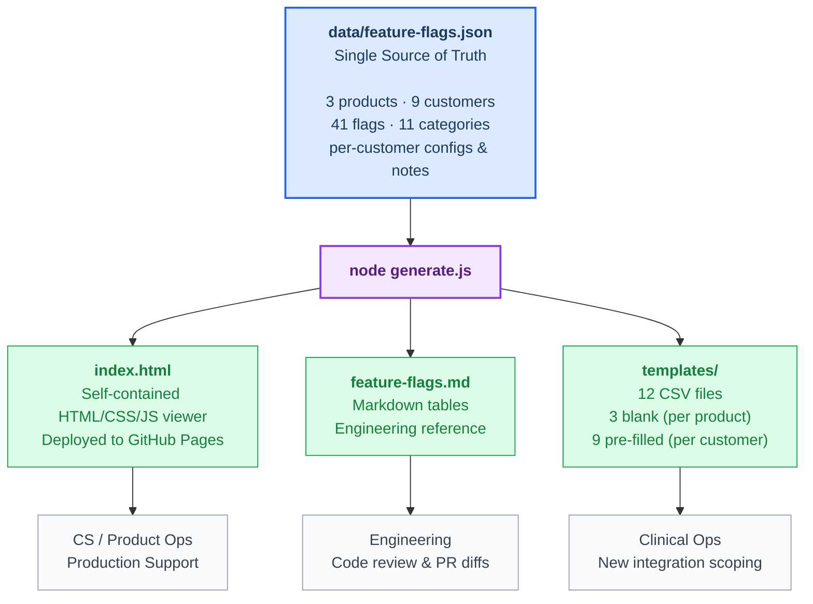
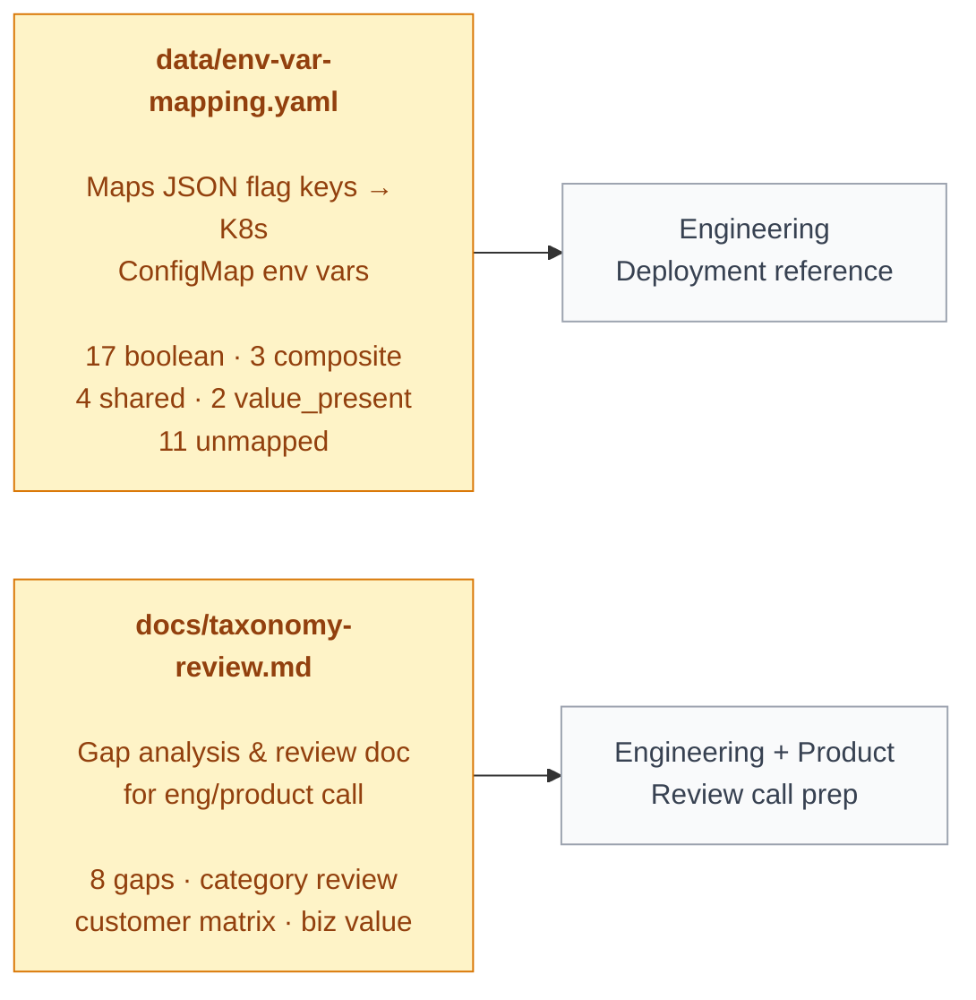
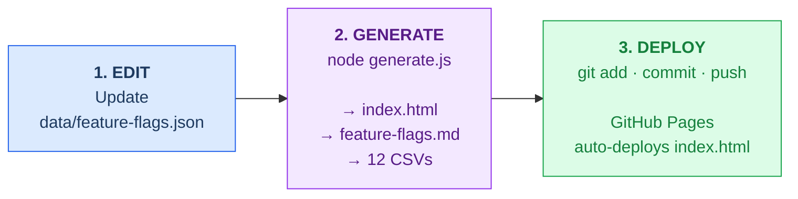
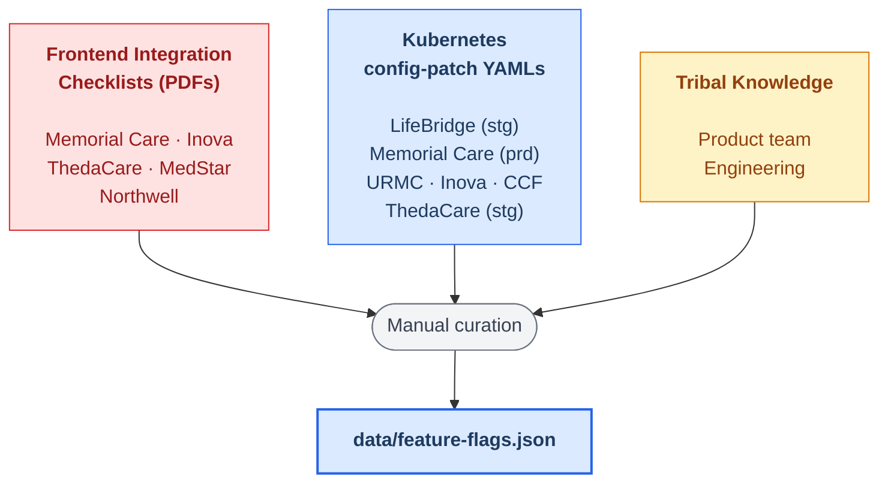
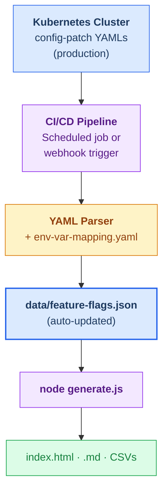

# Data Pipeline

## Core Pipeline

```mermaid
flowchart TD
    JSON["<b>data/feature-flags.json</b><br/>Single Source of Truth<br/><br/>3 products · 9 customers<br/>41 flags · 11 categories<br/>per-customer configs & notes"]
    GEN["<b>node generate.js</b>"]
    HTML["<b>index.html</b><br/>Self-contained HTML/CSS/JS viewer<br/>Deployed to GitHub Pages"]
    MD["<b>feature-flags.md</b><br/>Markdown tables<br/>Engineering reference"]
    CSV["<b>templates/</b><br/>12 CSV files<br/>3 blank (per product)<br/>9 pre-filled (per customer)"]
    A1["CS / Product Ops<br/>Production Support"]
    A2["Engineering<br/>Code review & PR diffs"]
    A3["Clinical Ops<br/>New integration scoping"]

    JSON --> GEN
    GEN --> HTML
    GEN --> MD
    GEN --> CSV
    HTML --> A1
    MD --> A2
    CSV --> A3

    style JSON fill:#dbeafe,stroke:#2563eb,stroke-width:2px,color:#1e3a5f
    style GEN fill:#f3e8ff,stroke:#9333ea,stroke-width:2px,color:#581c87
    style HTML fill:#dcfce7,stroke:#16a34a,color:#15803d
    style MD fill:#dcfce7,stroke:#16a34a,color:#15803d
    style CSV fill:#dcfce7,stroke:#16a34a,color:#15803d
    style A1 fill:#f9fafb,stroke:#9ca3af,color:#374151
    style A2 fill:#f9fafb,stroke:#9ca3af,color:#374151
    style A3 fill:#f9fafb,stroke:#9ca3af,color:#374151
```

---

## Supporting Files

```mermaid
flowchart LR
    YAML["<b>data/env-var-mapping.yaml</b><br/><br/>Maps JSON flag keys → K8s<br/>ConfigMap env vars<br/><br/>17 boolean · 3 composite<br/>4 shared · 2 value_present<br/>11 unmapped"]
    TAX["<b>docs/taxonomy-review.md</b><br/><br/>Gap analysis & review doc<br/>for eng/product call<br/><br/>8 gaps · category review<br/>customer matrix · biz value"]
    ENG["Engineering<br/>Deployment reference"]
    PROD["Engineering + Product<br/>Review call prep"]

    YAML --> ENG
    TAX --> PROD

    style YAML fill:#fef3c7,stroke:#d97706,color:#92400e
    style TAX fill:#fef3c7,stroke:#d97706,color:#92400e
    style ENG fill:#f9fafb,stroke:#9ca3af,color:#374151
    style PROD fill:#f9fafb,stroke:#9ca3af,color:#374151
```

---

## Edit → Generate → Deploy

```mermaid
flowchart LR
    EDIT["<b>1. EDIT</b><br/>Update<br/>data/feature-flags.json"]
    GENERATE["<b>2. GENERATE</b><br/>node generate.js<br/><br/>→ index.html<br/>→ feature-flags.md<br/>→ 12 CSVs"]
    DEPLOY["<b>3. DEPLOY</b><br/>git add · commit · push<br/><br/>GitHub Pages<br/>auto-deploys index.html"]

    EDIT --> GENERATE --> DEPLOY

    style EDIT fill:#dbeafe,stroke:#2563eb,color:#1e3a5f
    style GENERATE fill:#f3e8ff,stroke:#9333ea,color:#581c87
    style DEPLOY fill:#dcfce7,stroke:#16a34a,color:#15803d
```

---

## Data Sources (V0 — Manual)

```mermaid
flowchart TD
    PDF["<b>Frontend Integration<br/>Checklists (PDFs)</b><br/><br/>Memorial Care · Inova<br/>ThedaCare · MedStar<br/>Northwell"]
    K8S["<b>Kubernetes<br/>config-patch YAMLs</b><br/><br/>LifeBridge (stg)<br/>Memorial Care (prd)<br/>URMC · Inova · CCF<br/>ThedaCare (stg)"]
    TK["<b>Tribal Knowledge</b><br/><br/>Product team<br/>Engineering"]
    CURATE(["Manual curation"])
    JSON["<b>data/feature-flags.json</b>"]

    PDF --> CURATE
    K8S --> CURATE
    TK --> CURATE
    CURATE --> JSON

    style PDF fill:#fee2e2,stroke:#dc2626,color:#991b1b
    style K8S fill:#dbeafe,stroke:#2563eb,color:#1e3a5f
    style TK fill:#fef3c7,stroke:#d97706,color:#92400e
    style CURATE fill:#f3f4f6,stroke:#6b7280,color:#374151
    style JSON fill:#dbeafe,stroke:#2563eb,stroke-width:2px,color:#1e3a5f
```

---

## Future State (V1 — Automated Sync)

```mermaid
flowchart TD
    K8S["<b>Kubernetes Cluster</b><br/>config-patch YAMLs<br/>(production)"]
    CI["<b>CI/CD Pipeline</b><br/>Scheduled job or<br/>webhook trigger"]
    PARSER["<b>YAML Parser</b><br/>+ env-var-mapping.yaml"]
    JSON["<b>data/feature-flags.json</b><br/>(auto-updated)"]
    GEN["<b>node generate.js</b>"]
    OUT["index.html · .md · CSVs"]

    K8S --> CI
    CI --> PARSER
    PARSER --> JSON
    JSON --> GEN
    GEN --> OUT

    style K8S fill:#dbeafe,stroke:#2563eb,color:#1e3a5f
    style CI fill:#f3e8ff,stroke:#9333ea,color:#581c87
    style PARSER fill:#fef3c7,stroke:#d97706,color:#92400e
    style JSON fill:#dbeafe,stroke:#2563eb,stroke-width:2px,color:#1e3a5f
    style GEN fill:#f3e8ff,stroke:#9333ea,color:#581c87
    style OUT fill:#dcfce7,stroke:#16a34a,color:#15803d
```
